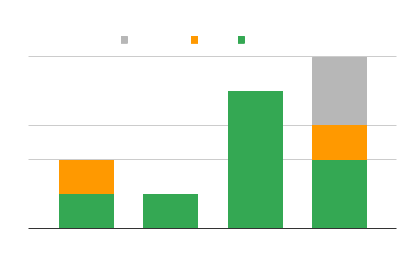

## Publications

Note: 
- *+ denotes equal contribution*;
- Names of students mentored by me are underlined;
- My name (**Thanh Le-Cong**) is bolded in the publications below.

<!--  -->
<!-- **Summary:**  ICSE x 2, ESEC/FSE x 2, TSEx 1, SANER x 1, ICSME x 1, ISSRE x 1 -->

<!-- <a href="#current" class="button next scrolly">2023</a>
<a href="#last" class="button next scrolly">2022</a>
<a href="#prior" class="button next scrolly">Prior</a> -->

<section id="current">
</section>

### In Submission

1. **[TSE-Review] PatchZero: Zero-Shot Automatic Patch Correctness Assessment.** *by Xin Zhou, Bowen Xu, Kisub Kim, DongGyun Han, **Thanh Le-Cong**, Junda He, Bach Le, and David Lo* submitted to IEEE Transactions on Software Engineering <a href="https://arxiv.org/pdf/2303.00202.pdf">.

2. **[Under-Review] Code Quality Issues in ChatGPT-Generated Code.** *Liu Yue, **Thanh Le-Cong**, Ratnadira Widyasari, Chakkrit Tantithamthavorn, Li Li, Bach Le, David Lo* submitted to IEEE Transactions on Software Engineering 
<!-- <a href="https://arxiv.org/pdf/2303.00202.pdf">. -->

3. **[Under-Review] GNN-Infer: Property Inference for Graph Neural Networks** *by Thanh-Dat Nguyen, **Thanh Le-Cong**, Bach Le, David Lo, ThanhVu H. Nguyen*, Under Review.

4. **[Under-Review] Can Code Summarization Succeed with Unseen Projects?** *by <u>Hung Nguyen</u>, **Thanh Le-Cong**, <u>Hung Le</u>, <u>Loc Nguyen</u>, Bach Le, Quyet-Thang Huynh, David Lo*, Under Review.

### 2023

2. **[TSE'23] MiDas: Multi-Granularity Detector for Vulnerability Fixes** *by Truong Giang Nguyen, **Thanh Le-Cong**, Hong Jin Kang, Ratnadira Widyasari, Chengran Yang, Zhipeng Zhao, Bowen Xu, Jiayuan Zhou, Xin Xia, Ahmed E. Hassan, Bach Le, and David Lo* IEEE Transactions on Software Engineering    .
- (One-line Abstract) Identifying vulnerability fixes by analyzing multi-granularity of code changes. 

1. **[TSE'23] Invalidator: Automated Patch Correctness Assessment via Semantic and Syntactic Reasoning** *by **Thanh Le-Cong**, Duc-Minh Luong, Bach Le, David Lo, Nhat Hoa Tran, Quang Huy Bui and Quyet Thang Huynh* at the IEEE Transactions on Software Engineering    .
- (One-line Abstract) Reasoning about the correctness of APR-generated patches via program invariants and code representation learning.

2. **[SANER'23] Topic Recommendation for GitHub Repositories: How Far Can Extreme Multi-Label Learning Go** *by Ratnadira Widyasari, Zhao Zhipeng, **Thanh Le-Cong**, Hong Jin Kang and David Lo* at the IEEE 30th International Conference on Software Analysis, Evolution and Reengineering (SANER) 2023, Research Track    .
- (One-line Abstract) An exploration study about the effectiveness of XML techniques on Github Topic Recommendation.

3. **[ICSE'23] Chronos: Time-Aware Zero-Shot Identification of Libraries from Vulnerability Reports** *by Yunbo Lyu+, **Thanh Le-Cong**+, Hong Jin Kang, Ratnadira Widyasari, Zhao Zhipeng, Bach Le, Ming Li and David Lo* at the IEEE/ACM 45th International Conference on Software Engineering (ICSE) 2023, Technical Track    . 
- (One-line Abstract) Practically identifying vulnerable libraries from vulnerability reports 
via zero-shot learning and domain-specific pre/post-processing.   
- **Note:** Our replication package was evaluated as Available
 and Functional .

<section id="last">
</section>

### 2022

1. **[ESEC/FSE'22] AutoPruner: Transformer-Based Call Graph Pruning** *by **Thanh Le-Cong**, Hong Jin Kang, Truong Giang Nguyen, Stefanus Agus Haryono, David Lo, Bach Le and Thang Huynh Quyet* at the ACM 30th Joint European Software Engineering Conference and Symposium on the Foundations of Software Engineering (ESEC/FSE) 2022, Research Track    .
- (One-line Abstract) Pruning false positives in static call graph via code features learned by Large Language Model and syntactic features extracted from original call graph.   
- **Note:** Our replication package was evaluated as Available  and Functional

2. **[ESEC/FSE'22] VulCurator: A Vulnerability-Fixing Commit Detector** *by Truong Giang Nguyen, **Thanh Le-Cong**, Hong Jin Kang, and Bach Le and David Lo* at the ACM 30th Joint European Software Engineering Conference and Symposium on the Foundations of Software Engineering (ESEC/FSE) 2022, Tool Demos Track   .
- (One-line Abstract) Identifying vulnerability-fixing commits by applying Large Language Model on multiple sources including code changes, commit messages and related issues.   

3. **[ICSME'22] FFL: Fine grained Fault Localization for Student Programs via Syntactic and Semantic Reasoning** *by Thanh-Dat Nguyen, **Thanh Le-Cong**, Duc-Minh Luong, and Van-Hai Duong, Bach Le, David Lo and Quyet-Thang Huynh* at the IEEE 38th International Conference on Software Maintenance and Evolution (ICSME) 2022, Research Track   
- (One-line Abstract) Automatically identifying fault locations in student programs by applying Graph Neural Network on a fine-grained graph-based representation of program which combines AST with test coverage information.

4. **[ICSE'22] Toward the Analysis of Graph Neural Networks** *by Thanh-Dat Nguyen+, <strong>Thanh Le-Cong</strong>+, ThanhVu H. Nguyen, Bach Le and Quyet-Thang Huynh* at the IEEE/ACM 44th International Conference on Software Engineering (ICSE) 2022, New Ideas and Emerging Results (NIER) Track, .
- (One-line Abstract) Discovering formal properties of GNNs by converting them into FFNNs and reusing existing FFNNs analyses.

<section id="prior">
</section>

### Prior

1. **Usability and Aesthetics: Better Together for Automated Repair of Web Pages** *by **Thanh Le-Cong**, Bach Le, Quyet-Thang Huynh, and Phi Le Nguyen* at the IEEE 32th International Symposium on Software Reliability Engineering (ISSRE) 2021, Research Track  
- (One-line Abstract) Automatically repairing mobile-unfrienly webpages using Evolutionary Optimization.

<!-- 2. Bao Hieu Tran, **Thanh Le-Cong**, Huu Manh Nguyen, Duc Anh Le, Thanh Hung Nguyen, Phi Le Nguyen. *“SAFL: A Self-Attention Scene Text Recognizer with Focal Loss.”* IEEE 19th International Conference on Machine Learning and Applications (ICMLA) 2020, Special Issues on Deep Learning. 
- (One-line Abstract) Automatically recognizing text in natural images using Transformer models with Focal Loss/

3. Thi Thanh Binh Huynh, Dinh Thanh Pham, Ba Trung Tran, **Thanh Le-Cong**, Minh Hai Phong Le, Ananthram Swami, Thu Lam Bui. *“A multifactorial optimization paradigm for linkage tree genetic algorithm”*, Information Sciences (2020). 
- (One-line Abstract) A new multitasking optimization algorithms based on likage tree genetic algorithm. -->

## Open Sources
1. "MiDas: Multi-granularity Detector for Vulnerability Fixes".  
1. "Chronos: Zero-Shot Identification of Libraries from Vulnerability Reports".  
3. "Invalidator: Automated Patch Correctness Assessment via Semantic and Syntactic Reasoning"  .
3. "VulCurator: A Vulnerability-Fixing Commit Detector"  .
2. "AutoPruner: Transformer-based Call Graph Pruning".  .

## Talks
### CHRONOS: Time-Aware Zero-Shot Identification of Libraries from Vulnerability Reports

*[ICSE 2023](https://conf.researchr.org/home/icse-2023) - May 2023*  

Tools that alert developers about library vulnerabilities depend on accurate, up-to-date vulnerability databases which are maintained by security researchers. These databases record the libraries related to each vulnerability. However, the vulnerability reports may not explicitly list every library and human analysis is required to determine all the relevant libraries. Human analysis may be slow and expensive, which motivates the need for automated approaches. Researchers and practitioners have proposed to automatically identify libraries from vulnerability reports using extreme multi-label learning (XML).

While state-of-the-art XML techniques showed promising performance, their experiment settings do not practically fit what happens in reality. Previous studies randomly split the vulnerability reports data for training and testing their models without considering the chronological order of the reports. This may unduly train the models on chronologically newer reports while testing the models on chronologically older ones. However, in practice, one often receives chronologically new reports, which may be related to previously unseen libraries. Under this practical setting, we observe that the performance of current XML techniques declines substantially, e.g., F1 decreased from 0.7 to 0.24 under experiments without and with consideration of chronological order of vulnerability reports. In this talk, I present Chronos, a novel library identification approach introduced at ICSE 2023 for automatically suggesting vulnerable libraries using zero-shot learning along with two task-specific mechanism: data enhancement and time-aware adjustment. In our experiments, CHRONOS achieves an average F1-score of 0.75, 3x better than the best XML-based approach. Task-specific mechanism improve CHRONOS over the vanilla zero-shot learning model by 27% in average F1.

### Property Inference for DNN 

*[BK.AI Seminar Series](https://bkai.ai/seminar-property-inference-for-dnn/) & [VNU-UET RD320 Seminar Series](https://www.facebook.com/rd320uet/) - August 2022*  

Deep Neural Networks (DNNs) have recently emerged as a powerful framework for solving complex real-world problems, including safety-critical tasks such as autonomous driving, finance, and medical diagnosis. Despite their popularity, it has been shown that DNNs can be vulnerable and unreliable. Ensuring the reliability and trustworthiness of DNNs thus becomes an increasingly challenging and essential task. Towards this, researchers recently have developed DNNs analyses, e.g., verification or testing, to provide insights into the behaviors of DNNs.
In this talk, we will study property inference – a new research direction on DNNs analysis. First, I introduce the property inference for deep neural networks. Then, I present the first work on the research direction, Prophecy, which automatically infers the formal properties of feed-forward neural networks and gets introduced at ASE 2019. Finally, GNN-Infer, a new property inference technique introduced at ICSE 2022, is presented towards discovering formal properties for graph neural networks.

### AutoPruner: Transformer-based Call Graph Pruning 
*[ESEC/FSE 2022](https://2022.esec-fse.org/) & [SOLA Weekly Seminars](https://www.software-lab.org/) - November 2022* 

<!-- <iframe width="560" height="315" src="https://www.youtube.com/embed/VP6535R2QvQ" frameborder="0" allow="accelerometer; autoplay; encrypted-media; gyroscope; picture-in-picture" allowfullscreen></iframe> -->

Constructing a static call graph requires trade-offs between soundness and precision. Program analysis techniques for constructing call graphs are unfortunately usually imprecise. To address this problem, researchers have recently proposed call graph pruning empowered by machine learning to post-process call graphs constructed by static analysis. A machine learning model is built to capture information from the call graph by extracting structural features for use in a random forest classifier. It then removes edges that are predicted to be false positives. Despite the improvements shown by machine learning models, they are still limited as they do not consider the source code semantics and thus often are not able to effectively distinguish true and false positives. In this talk, I presents AutoPruner, a novel call graph pruning technique introduced at ESEC/FSE 2022 for eliminating false positives in call graphs via both
statistical semantic and structural analysis.

