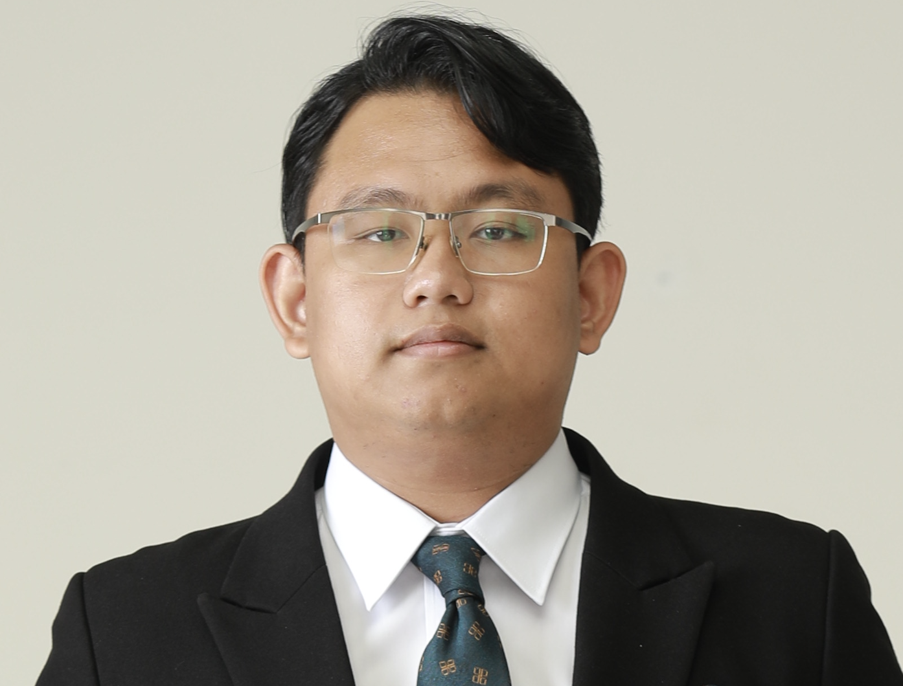

<table>
  <tr>
    <td style="vertical-align: middle;width: 22%;"></td>
    <td style="width: 78%;">
      
 Hello, I am Thanh Le-Cong (Lê Công Thành in Vietnamese), a first-year Ph.D. student at <a href="https://www.cis.unimelb.edu.au/"> CIS, The University of Melbourne </a>, working with <a href="https://xuanbachle.github.io/"> Dr. Bach Le </a> and <a href="https://people.eng.unimelb.edu.au/tobym/"> Prof. Toby Murray</a>. Prior to joining UoM, I worked as a research engineer at <a href="https://soarsmu.github.io/"> SOAR (SOftware Analytic Research)</a>, <a href="https://smu.edu.sg/"> Singapore Management University</a> under the advisor of <a href="http://www.mysmu.edu/faculty/davidlo/"> Prof. David Lo</a>. My research aim to improve developer productivity by creating automated solutions for managing, localizing, and resolving software bugs and vulnerabilities. Specifically, I am focusing on ensuring the reliability and trustworthiness of data-driven software debugging and bug management techniques. My current topic is improving the trustworthiness of automated program repair systems.
      

    </td>
  </tr>
</table>

## Research interests

+ [Automated Program Repair](https://cacm.acm.org/magazines/2019/12/241055-automated-program-repair/abstract),
+ [Mining Software Repositories](https://en.wikipedia.org/wiki/Mining_software_repositories),
+ Artifical Intellgence for Software Engineering,
+ [Neural Software Analysis](https://cacm.acm.org/magazines/2022/1/257449-neural-software-analysis/abstract)

## Education

#### Ph.D Student, [CIS@The University of Melbourne](https://cis.unimelb.edu.au), Feb 2023 - Now
*Funded by the Melbourne Research Scholarship*
- Advisor: Dr. Bach Le and Prof. Toby Murray

#### BSc, [SOICT@Hanoi University of Science and Technology](https://soict.hust.edu.vn/), Sep 2016 - Sep 2021
- Advisor: Prof. Huynh Quyet Thang
- Topic: The development of Automated Patch Validation for Program Repair.

## Featured Publications
*+ denotes equal contribution*

1. **[TSE'23] Invalidator: Automated Patch Correctness Assessment via Semantic and Syntactic Reasoning** by <u>Thanh Le-Cong</u>, Duc-Minh Luong, Bach Le, David Lo, Nhat Hoa Tran, Quang Huy Bui and Quyet Thang Huynh at IEEE Transactions on Software Engineering (Just Accepted) ([PDF](./pdf/TSE_Invalidator.pdf), [Code](https://github.com/thanhlecongg/Invalidator), [Dataset](https://zenodo.org/record/7475916)).
- (One-line Abstract) Reasoning about the correctness of APR-generated patches via program invariants and code representation learning.

2. **[ICSE'23] Chronos: Time-Aware Zero-Shot Identification of Libraries from Vulnerability Reports** by Yunbo Lyu+, <u>Thanh Le-Cong</u>+, Hong Jin Kang, Ratnadira Widyasari, Zhao Zhipeng, Bach Le, Ming Li and David Lo at the IEEE/ACM 45th International Conference on Software Engineering (ICSE) 2023, Technical Track ([PDF](./pdf/ICSE_Chronos.pdf), [Code](https://github.com/soarsmu/Chronos), [Dataset](https://figshare.com/articles/software/Chronos-ICSE23/20787805)).  
- (One-line Abstract) Practically identifying vulnerable libraries from vulnerability reports 
via zero-shot learning and domain-specific pre/post-processing.  

3. **[ESEC/FSE'22] AutoPruner: Transformer-Based Call Graph Pruning** by <u>Thanh Le-Cong</u>, Hong Jin Kang, Truong Giang Nguyen, Stefanus Agus Haryono, David Lo, Bach Le and Thang Huynh Quyet at the ACM 30th Joint European Software Engineering Conference and Symposium on the Foundations of Software Engineering (ESEC/FSE), Research Track 2022 ([PDF](./pdf/FSE_AutoPruner.pdf), [Code](https://github.com/soarsmu/AutoPruner), [Dataset](https://zenodo.org/record/6369874#.YjWzmi8RppR)).  
- (One-line Abstract) Pruning false positives in static call graph via code features learned by Large Language Model and syntactic features extracted from original call graph.   

4. **[ICSE'22] Toward the Analysis of Graph Neural Networks** *by Thanh-Dat Nguyen+, <strong>Thanh Le-Cong</strong>+, ThanhVu H. Nguyen, Bach Le and Quyet-Thang Huynh* at the IEEE/ACM 44th International Conference on Software Engineering (ICSE) 2022, New Ideas and Emerging Results (NIER) Track
- (One-line Abstract) Discovering formal properties of GNNs by converting them into FFNNs and reusing existing FFNNs analyses.

