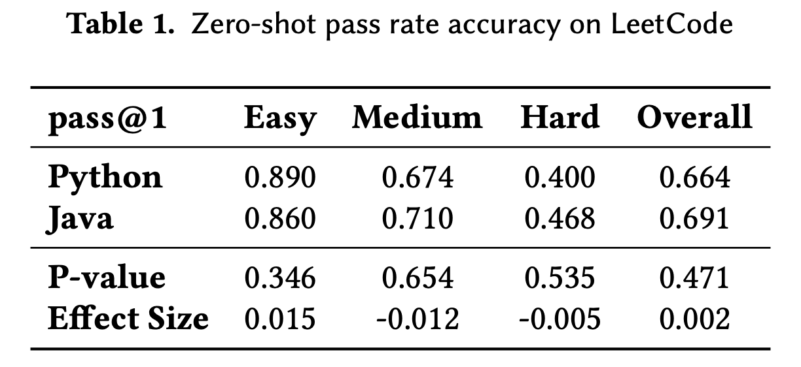
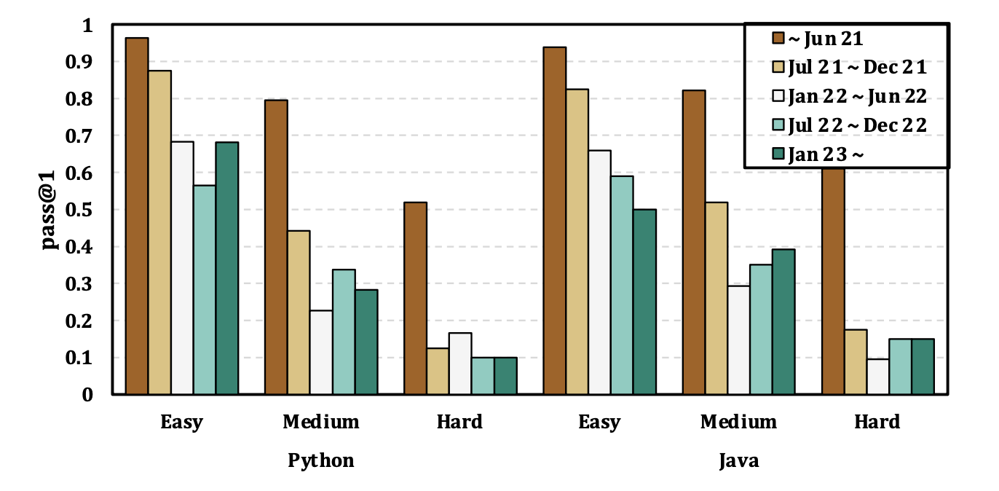
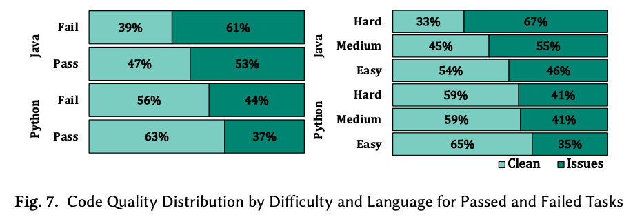
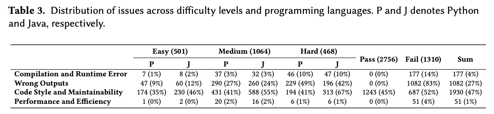
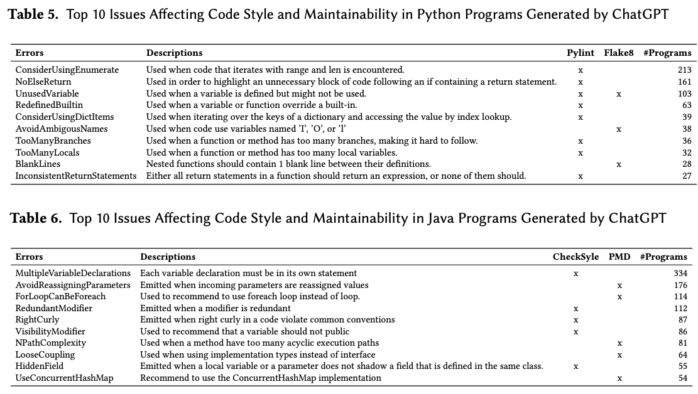
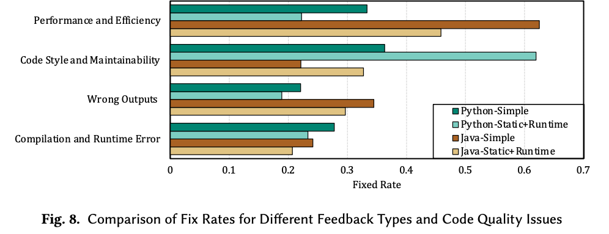
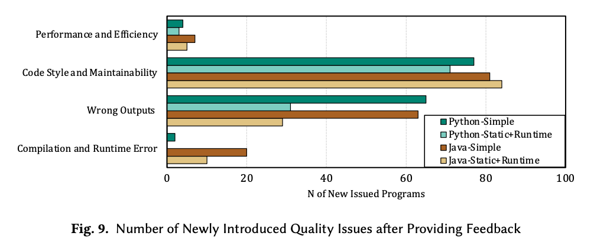
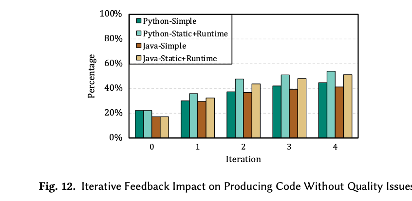

# 🚀 Refining ChatGPT-Generated Code: Characterizing and Mitigating Code Quality Issues?✂️
*by Yue Liu, Thanh Le-Cong, Ratnadira Widyasari, Chakkrit Tantithamthavorn, Li Li, Bach Le, David Lo*

    <a href="https://dl.acm.org/doi/abs/10.1145/3540250.3549175">
    <a href="https://arxiv.org/abs/2307.12596.pdf">
     
    

## 💥 Motivation & Approach
Since its introduction in November 2022, ChatGPT has gained rapid popularity for its exceptional language understanding and human-like responses. However, concerns linger regarding the reliability and quality of code generated by ChatGPT, especially in code generation. This paper systematically examines the quality of 4,066 ChatGPT-generated code implementations in Java and Python for 2,033 programming tasks. The goal of this work is three folds. First, we analyze the correctness of ChatGPT on code generation tasks and uncover the factors that influence its effectiveness, including task difficulty, programming language, time that tasks are introduced, and program size. Second, we identify and characterize potential issues with the quality of ChatGPT-generated code. Last, we provide insights into how these issues can be mitigated.

## 📈 Experimental Results

### Performance of ChatGPT

#### Task Difficulty
ChatGPT show a outstanding performance in easy tasks with ~90% of functionally-correct answers. However, its performance significantly drops to ~60% and ~40% in medium and hard tasks. 

  

#### Established Time
ChatGPT excels on problems established before June 2021, consistent with its training data, with over 90%, 80%, and 50% of functionally-correct code for easy, medium, and hard problems. However, performance drops to less than 70% for easy tasks and significantly worse for hard tasks (with less than 20% of functionally-correct code), emphasizing the need for up-to-date models to handle evolving programming challenges.

  

### Code Quality Issues in Code Generated by ChatGPT

  

In an in-depth analysis on quality issues of code generated by ChatGPT, we found that code quality issues commonly happen in both code that pass or failed test cases. Particularly, 47\% and 63\% of functionally-correct code generated by ChatGPT in Java and Python still face code quality issues. These findings highlights the need for characterizing and addressing these concerns alongside functional correctness.

  

To gain deeper insights about these issues, we categorize these issues into four main categories: 
- Compilation
& Runtime Errors, 
- Wrong Outputs, 
- Code Style & Maintainability, 
- Performance & Efficiency 

and found that Wrong Outputs and Code Style & Maintainability issues are the most common challenges
faced by the ChatGPT-generated code while Compilation & Runtime Errors and Performance &
Efficiency issues are relatively less prevalent.

We also further investigate most prevalent Code Style & Maintainability issues in Java and Python. Suprisingly, ChatGPT-generated code even can face simple mistakes such as Unuse variable. These findings raise awareness about the quality of ChatGPT-generated code and call for future research on investigating and mitigating these problems. 

  

### Repair with Feedbacks

To address the aforementioned issues, we attemped to use ChatGPT to self-repair these issues by providing feedbacks and found that ChatGPT shows great promise in self-repairing code quality issues, achieving a fixed
rate of 20% to 60%.

  

Regrettably, we discovered that despite ChatGPT's effectiveness in addressing code quality issues through self-repair, it still introduces new issues in the generated fixes. As a result, only 20% of code with quality issues is free from these issues after self-repairing of ChatGPT. 

  

To solve these problems, we attempted to use a iterative repairing, i.e., employ ChatGPT's self-repairing with feedbacks process in multiple rounds. Experimental results show that iterative repairing can increase from 20% to around 60%. However, the trend is saturated when the number of rounds increase. These findings prove the effectiveness of iterative repairing, particularly when guided by detailed feedback that incorporates static analysis and runtime errors. While these results are promising, it is far from perfect, yet leaving room for future research in this direction.

  

